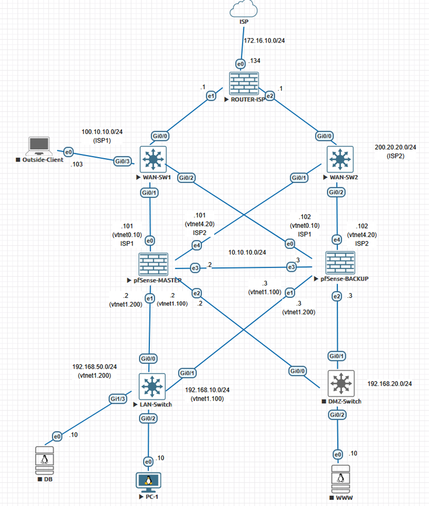

# Enterprise-Edge-Security-pfSense
# 🛡️ High Availability E-commerce Network Defense (pfSense HA Cluster)

## 📌 About the Project
🚧 Work in Progress: The core architecture and topology are uploaded. I am currently in the process of adding the pfSense XML configuration files and proof-of-concept screenshots (Suricata IDS logs and CARP failover PCAPs).
This repository contains the documentation and configuration of an engineering network project aimed at securing an e-commerce infrastructure and **eliminating the Single Point of Failure (SPOF)**. 

The project demonstrates a practical implementation of **Zero Trust** and **Defense in Depth** policies using Open Source solutions, building an environment with stringent High Availability requirements typical of Enterprise-class infrastructures.

**Author:** Natan Zawadzki  
**Project developed as part of a B.Sc. Engineering Thesis (2026).**

---

## 🏗️ Architecture & Topology
The environment was designed and deployed in the **EVE-NG** network emulator (based on the KVM hypervisor). 

---

## ✨ Key Implemented Features

### 1. High Availability Cluster (HA)
* Utilization of the **CARP** (Common Address Redundancy Protocol) for IP address redundancy.
* Implementation of the **pfsync** mechanism on a dedicated interface (VLAN) for continuous State Table synchronization. 
* **Result:** In the event of a physical Master node failure (e.g., power outage), the Backup node takes over the traffic in under 3 seconds without dropping active TCP sessions.

### 2. Network Segmentation & RBAC (Zero Trust)
* Deployment of **VLANs (802.1Q)** to strictly isolate traffic zones (LAN, DMZ, WAN, SYNC).
* Configuration of strict Role-Based Access Control (RBAC) firewall rules utilizing a *Default Deny* policy.

### 3. Advanced Protection (IDS/IPS & Geo-blocking)
* **Suricata (IPS):** Deep Packet Inspection (DPI) with active threat blocking (including port scanning and DoS attacks).
* **pfBlockerNG-devel:** Reputation-based protection and geographical traffic blocking from high-risk countries on the WAN interface.

### 4. Secure Remote Access
* Deployment of an **OpenVPN** server using strong cryptography (AES-256-GCM).
* Certificate-based user authentication (Public Key Infrastructure - PKI).

---

## 🛠️ Technologies Used
* **Core System:** pfSense (FreeBSD)
* **Virtualization Environment:** EVE-NG, QEMU/KVM
* **Layer 2:** Cisco vIOS L2 (Switching, VLAN, STP)
* **Client/Service Systems:** Ubuntu Server 24.04 LTS (WWW, DB)
* **Network Security:** Suricata, pfBlockerNG, OpenVPN
* **Auditing Tools:** Wireshark, Nmap, iperf3, Netcat

---

## 📊 Verification & Testing (Proof of Concept)

### Failover Test
The MAC address change in the packet capture indicates the immediate takeover of the VIP address by the standby firewall node without interrupting communication.

### Intruder Blocking (Suricata)
The system automatically detects and drops packets during an aggressive network scanning attempt using Nmap.

---

## 🚀 How to run this lab?
1. Import the `.unl` (or `.zip`) topology file into your EVE-NG server.
2. Ensure you have the `pfSense` and `vios-l2` images uploaded to the appropriate EVE-NG directories.
3. Import the `.xml` configuration files (located in the `configs/` directory) directly into the pfSense nodes to restore the HA cluster and firewall rules.

---
*This project is for educational and demonstration purposes. It was prepared as part of engineering documentation validating practical skills in network engineering and cybersecurity.*
