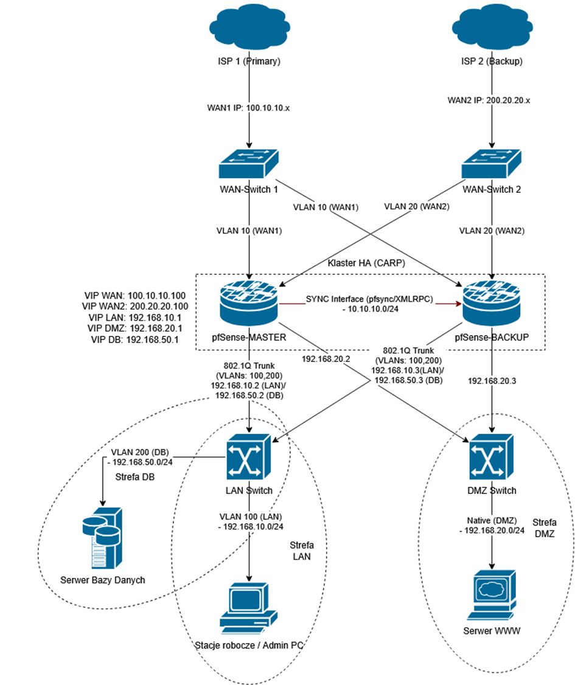
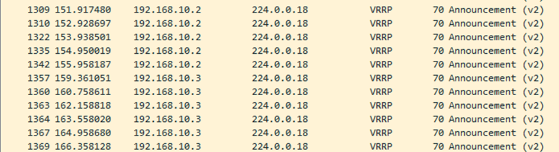
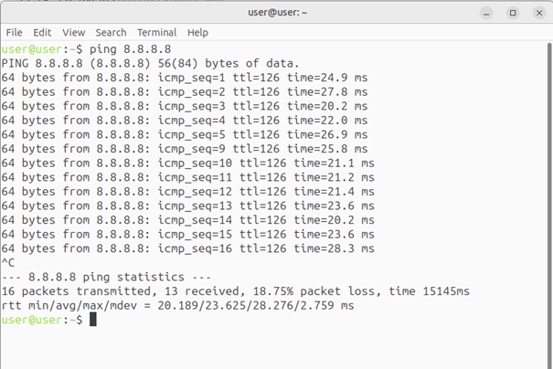
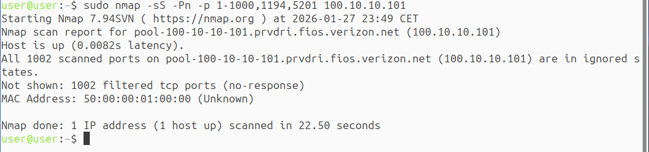
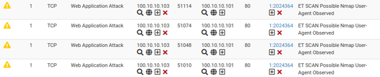
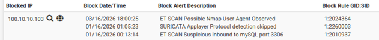

# High Availability E-commerce Network Defense 🛡️


In modern e-commerce, a Single Point of Failure (SPOF) at the network edge means unacceptable downtime and financial loss. This project elmininates SPOF by implementing a fully redundant, High Availability cluster and a Zero Trust network architecture using strictly open-source solutions to achive enterprise-grade security.


</br>*> Logical topology of the designed enviroment.*

## 🛠️ Technologies
* **Firewall & Routing:** pfSense
* **Network Security:** Suricata, pfBlockerNG, OpenVPN
* **Auditing:** Wireshark, Nmap, iperf3, Netcat, Syslog
* **Layer 2:** Cisco vIOS L2
* **Client Systems:** Ubuntu MATE 24.04.3 LTS
* **Server Systems:** Ubuntu Server 24.04 LTS
* **Virtualization Environment:** EVE-NG, VMWare Workstation Pro

## ✨ Features

### 1. Active-Passive HA Cluster
* Utilization of the **CARP** for IP address redundancy.
* Implementation of the **pfsync** mechanism on a dedicated interface for continuous State Table synchronization. 
* **Result:** In the event of a physical Master node failure, the Backup node takes over the traffic in under 3 seconds without dropping active TCP sessions.

### 2. Zero Trust Architecture
* Deployment of **VLANs (802.1Q)** to strictly isolate traffic zones (LAN, DB, WAN).
* Configuration of strict Role-Based Access Control firewall rules utilizing a *Default Deny* policy.

### 3. Advanced Protection
* **Suricata (IPS):** Deep Packet Inspection with active threat blocking.
* **pfBlockerNG-devel:** Reputation-based protection and geographical traffic blocking from high-risk countries on the WAN interface.

### 4. Secure Remote Access
* Deployment of an **OpenVPN** server using strong cryptography (AES-256-GCM).
* Certificate-based user authentication (Public Key Infrastructure - PKI).

### 5. Cost Efficency
* Enterprise-level edge protection achieved without expensive proprietaty licensing.

## ⚙️ The Process
The creation of this environment was divided into four distinct engineering phases, progressing from theoretical design to deep technical implementation.

### Phase 1: Architectural Design & Threat Modeling
Before booting up any virtual machines, I mapped out the business requirements. The primary goal was to protect an e-commerce edge against SPOF and external attacks. I designed a **Zero Trust** topology relying on **802.1Q VLANs** to strictly separate the WAN, DMZ, LAN and DB zones.

### Phase 2: EVE-NG Provisioning & Hypervisor Setup
This project required a custom-built, hardware-emulated laboratory. After deploying the **EVE-NG** virtual machine on VMware Workstation Pro, I had to manually provision the operating systems for the nodes:
* Established a secure connection to the EVE-NG underlying Linux environment using **WinSCP**.
* Created custom virtual hard drives and transferred the '.iso' installation images (pfSense, Ubuntu Server, Ubuntu MATE) and the '.vmdk' virtual machine disk (Cisco L2 Switch) directly into the hypervisor.
* Strictly adhered to EVE-NG's QEMU node naming conventions to ensure the emulator correctly recognized and booted the custom pfSense and Linux nodes.

### Phase 3: Network Infrastructure & High Availability
With the nodes successfully booting, I built the core network:
1. **Layer 2 Segmentation:** Configured Cisco vIOS switches with 802.1Q trunking to distribute VLANs across the environment.
2. **Cluster Initialization:** Deployed two pfSense firewalls, Master and Backup.
3. **Redundancy:** Created a Virtual IP using the **CARP** protocol ont the WAN and LAN interfaces. To achieve stateful failover, I established a dedicated, physically untagged network link between the firewalls. I configured XMLRPC and **pfsync** over this link to replicate the State Table in real-time.

### Phase 4: Security Hardening & Zero Trust Implementation
The final phase focused on turning the edge routers into an enterprise-grade security perimeter:
* **Access Control:** Implemented a strict *Default Deny* firewall policy, utilizing Role-Based Access Control to premit only essential traffic between specific VLANs.
* **Intrusion Prevention:** Deployed Suricata IPS on the WAN edge. To make it work in a virtualized 'virtio' environment, I disabled Hardware Checksum Offloading and configurated Suricata in *Legacy Mode* with a custom Pass List.
* **Threat Intelligence:** Configured **pfBlockerNG** for Geo-blocking to instantly drop traffic from high-risk regions.
* **Secure Management:** Set up an **OpenVPN** server with Public Key Infrastructure to ensure the firewalls could only be administrated via a secure, encrypted tunnel.

## 📊 Proof of Concept / Testing

### Test 1: Failover Test
* **Scenario:** Simulated a sudden hardware failure of the Master pfSense node during active traffic.
* **Result:** The Backup node successfully detected the missing CARP heartbeats and assumed the Master role. The failover occured in ~3 seconds, and thanks to 'pfsync' state replication, active TCP sessions were not dropped.



</br>*> ICMP traffic dropping and recovering in ~3 seconds without breaking the session.*

### Test 2: Penetration Testing vs. IPS
* **Scenario:** An aggressive SYN port scan ('nmap -sS -Pn') was launched from an external WAN machine to map the edge network.
* **Result:** Suricata successfully detected the scanning signatures ('ET SCAN Possible Nmap User-Agent Observed') and immediately dropped the attacker's IP at the network layer. The firewall entered Stealth Mode, returning zero information.


</br>*> An attempt to map the edge network*



</br>*> Automatic IP block applied by Suricata IPS in response to the scan.*

## 💡 What I Learned
* **Virtualization Nuances with IDS/IPS:** I discovered that hardware checksum offloading in hypervisors corrupts packets from Suricata's prespective. I learned how to troubleshoot this by disabling Hardware Cheksum Offloading in pfSense to allow proper deep packet inspection.
* **Inline IPS vs Legacy Mode:** I learned that 'virtio' network drivers used in virtualized environments require Suricata to run in Legacy Mode with a custom Pass List rather than Inline Mode to successfully drop malicious packets.
* **Stateful High Availability:** Gained a deep, practical understanding of how CARP handles VIP elections and why replicating the State Table via a dedicated link is crucial for seamless user experience.
* **Perimeter Threat Intelligence:** Discovered the computational efficency of using pfBlockerNG. I learned that dropping known malicious IPs and entire high-risk countries directly at the edge drastically reduces the processing load on the Deep Packet Inspection engine.
* **Secure Remote Access:** Transitioned from theory to practice regarding Public Key Infrastructure. I learned how to properly configure an OpenVPN server utilizing strong cryptography and certificate-based authentication, proving that administrative interfaces should never be directly exposed to the Internet.

## 🚀 Future Enhancements & Scalability
* **Hardware Scalability:** While this project was modeled in a virtual environment, the architecture is fully hardware-agnostic. Depending on the enterprise size and network throuhput requirements, this pfSense cluster can be seamlessly scaled by deploying it on dedicated, high-performance Netgate applances or custom bare-metal servers equipped with specialized NICs.
* **SIEM Integration:** Deploy a central SIEM solution to aggregate Syslog data and Suricata alerts into a single, actionable dashboard.
* **Network Automation:** Automate the initial deployment of the pfSense cluster, VLANs and firewall rules using Ansible (Infrastructure as Code).

## How to run this Project
This guide provides a step-by-step walkthrough to deploy and test this High Availability & Zero Trust environment on your local machine using EVE-NG.

### Step 1: Prerequisites & Hypervisor Setup
To run this lab, you will need a machine with at least 16GB of RAM and a CPU supporting virtualization (Intel VT-x/AMD-V).
1. Download and install **VMware Workstation Pro** (or VMware Workstation Player).
2. Download the **EVE-NG Community Edition** OVF/OVA file as well as **Windows Integration Pack** from the [official EVE-NG website](https://www.eve-ng.net/).
3. Import the EVE-NG OVA into VMware.
4. **CRITICAL:** Before powering on the VM, go to the VM settings -> Processors and check the box: 'Virtualize Intel VT-x/EPT or AMD-V/RVI'. This enables nested virtualization.
5. Power on the EVE-NG VM. Note the IP address displayed on the CLI screen (e.g., 'http://192.168.x.x').

### Step 2: Uploading Node Images
EVE-NG requires specific node images to run the firewalls, switches and clients. Use an FTP/SCP client like **WinSCP** or **FileZilla** to connect to your EVE-NG VM (Credentials: 'root' / 'eve').

You must upload the corresponding '.qcow2' image files into the following exact directories in '/opt/unetlab/addons/qemu/':
* **pfSense:** 'pfsense-2.7.2/' 
* **Cisco vIOS L2:** 'viosl2-adventerprisek9-m/'
* **Ubuntu Server:** 'linux-ubuntu-server/' 
* **Ubuntu MATE:** 'linux-ubuntu-mate/' 

*Note: Due to licensing, I cannot provide the OS image files in this repository. You must obtain them from their respective vendors.*

Once all images are uploaded, open the EVE-NG CLI and run the fix permissions command. **Do not skip this step:**
```bash
/opt/unetlab/wrappers/unl_wrapper -a fixpermissions
```
### Step 3: Importing the Topology
1. Open your web browser and navigate to the EVE-NG IP address (Credentials: admin/eve).
2. Download the *Ecommerce_pfSense_HA.unl* file from this GitHub repository.
3. In the EVE-NG WebGUI, click the **Import** button and upload the *.unl* file.
4. Open the imported lab. You should now see the complete visual topology.

### Step 4: Testing the Environment
1. Right-click on the nodes and select **Start** to boot up the environment.
2. The pfSense firewalls need their configurations. I have provided the XML backup files in the *configs/* folder of this repository.
3. Open the console of the *Admin PC* inside EVE-NG.
4. Open a web browser on the Admin PC and navigate to the pfSense WebGUI:
  * **Master pfSense:** https://192.168.10.2
  * **Backup pfSense:** https://192.168.10.3
  * **ROUTER-ISP:** https://100.10.10.1
5. Go to **Diagnostics -> Backup & Restore** and upload the respective *pfsense_master_config.xml*, *pfsense_backup_config.xml* and *pfsense_router_isp_config.xml* files. The firewalls will reboot.

*If you encounter any issues reproducing this lab, feel free to open an Issue in this repository!*

*This project is for educational and demonstration purposes. It was prepared as part of engineering documentation validating practical skills in network engineering and cybersecurity.*
